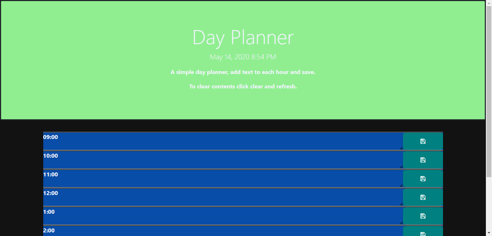

# Day Planner

> A Day planner I created in JavaScript, HTML, and CSS. 

>

# ScreenShot
</a>


- glance at  `README`, *maybe* star it


---


  


---

## Example 

```javascript


//create variables for where we will put the time
    var $dateTimeHeader = $("#currentTime");
        var $dateTimeElement = $("<p>");


```

---

## Useage
 https://jerniceduncan.github.io/05-DayPlanner/


## Clone it
https://github.com/jerniceduncan/05-DayPlanner.git

```
$ npm install
$ npm install moment
```